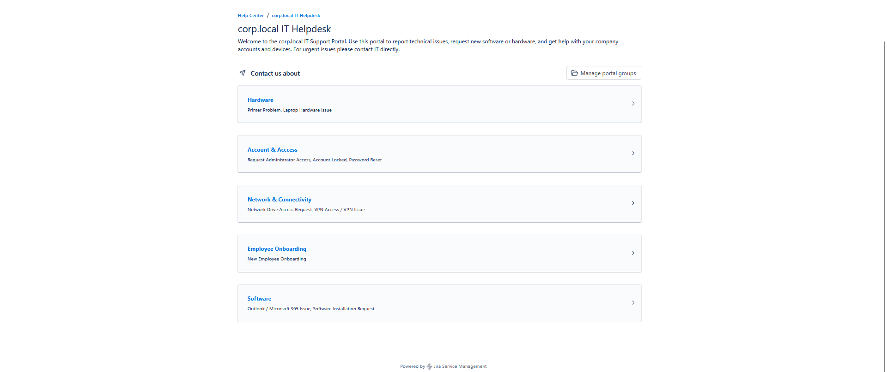
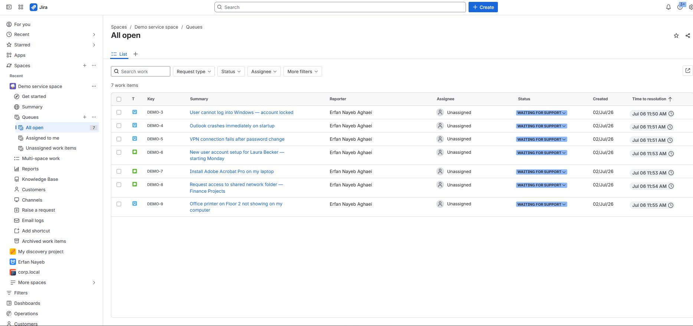
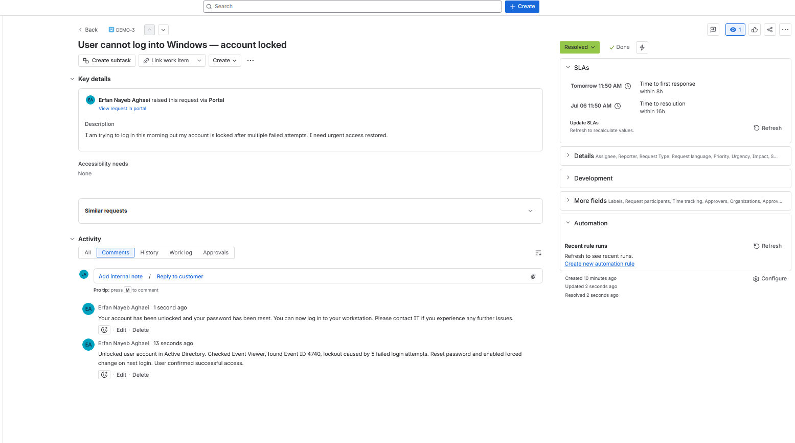
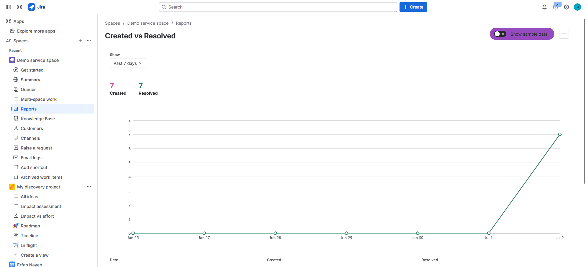

# IT Helpdesk Ticketing Lab

A simulated IT helpdesk environment built in **Jira Service Management** to practice real-world IT support workflows. This project covers the full ticket lifecycle, from submission through investigation, resolution, and documentation, across incidents, service requests, and support tasks.

---

## Project Overview

This lab simulates a small company IT helpdesk (corp.local) with a configured customer portal, categorized request types, and SLA tracking. All tickets were created, assigned, investigated, and resolved following standard ITIL helpdesk procedures.

**Tool used:** Jira Service Management (Free tier)  
**Simulated environment:** corp.local domain  
**Total tickets handled:** 7  
**Ticket types:** Incident, Service Request, Support, Task

---

## Skills Demonstrated

- Configuring a Jira Service Management project from scratch
- Setting up a customer-facing helpdesk portal with categorized request types
- Classifying tickets by type and priority (Incident, Service Request, Support, Task)
- Following the full ticket lifecycle: Open → In Progress → Resolved
- Writing internal technical notes for the IT team
- Writing clear customer-facing resolution replies
- Root cause analysis and prevention recommendations
- SLA awareness and time-to-resolution tracking

---

## Portal & Request Categories

The helpdesk portal was configured with the following request categories:

| Category               | Request Types                                                |
| ---------------------- | ------------------------------------------------------------ |
| Accounts & Access      | Password Reset, Account Locked, Request Administrator Access |
| Employee Onboarding    | New Employee Onboarding                                      |
| Software               | Software Installation Request, Outlook / Microsoft 365 Issue |
| Hardware               | Laptop Hardware Issue, Printer Problem                       |
| Network & Connectivity | VPN Access / VPN Issue, Network Drive Access Request         |

---

## Screenshots

### Customer Portal

---

### Ticket Queue — All Open

---

### Ticket Detail — Resolved Incident

---

### Reports — Created vs Resolved

---

## Tickets

| ID     | Type            | Title                                             | Priority | Status      |
| ------ | --------------- | ------------------------------------------------- | -------- | ----------- |
| DEMO-3 | Incident        | User cannot log into Windows — account locked     | High     | ✅ Resolved |
| DEMO-4 | Incident        | Outlook crashes immediately on startup            | Medium   | ✅ Resolved |
| DEMO-5 | Incident        | VPN connection fails after password change        | High     | ✅ Resolved |
| DEMO-6 | Service Request | New user account setup for Laura Becker           | Medium   | ✅ Resolved |
| DEMO-7 | Service Request | Install Adobe Acrobat Pro on laptop               | Low      | ✅ Resolved |
| DEMO-8 | Service Request | Request access to shared network folder           | Medium   | ✅ Resolved |
| DEMO-9 | Support         | Office printer on Floor 2 not showing on computer | Medium   | ✅ Resolved |

---

## Ticket Documentation

Each ticket is fully documented in the `/tickets` folder with:

- Problem description
- Investigation steps and tools used
- Resolution steps
- Root cause analysis
- Prevention recommendations

See individual ticket files for full details.

---

## Tools & Technologies Referenced

`Jira Service Management` `Active Directory` `Windows Event Viewer` `Group Policy (GPO)` `Remote Desktop (RDP)` `Microsoft 365` `Windows Credential Manager` `Microsoft Defender` `CMD / PowerShell` `DNS / DHCP` `VPN`
